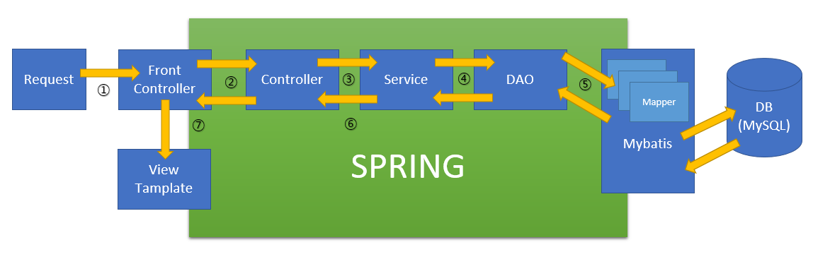

# javaCrud
스프링의 기본적인 MVC 디자인 패턴을 구현하였습니다.

# Review
스프링의 MVC 패턴을 토대로 구현한 미니 프레임워크 입니다.  
Spring MVC 패턴대로 아래 사진의 동작들을 구현하였습니다.  

추가적으로 해당 프레임워크를 이용하여 회원 등록, 조회, 삭제, 수정 / 프로젝트 등록, 조회, 삭제, 수정을 하는 동작들을 구현하였습니다.
